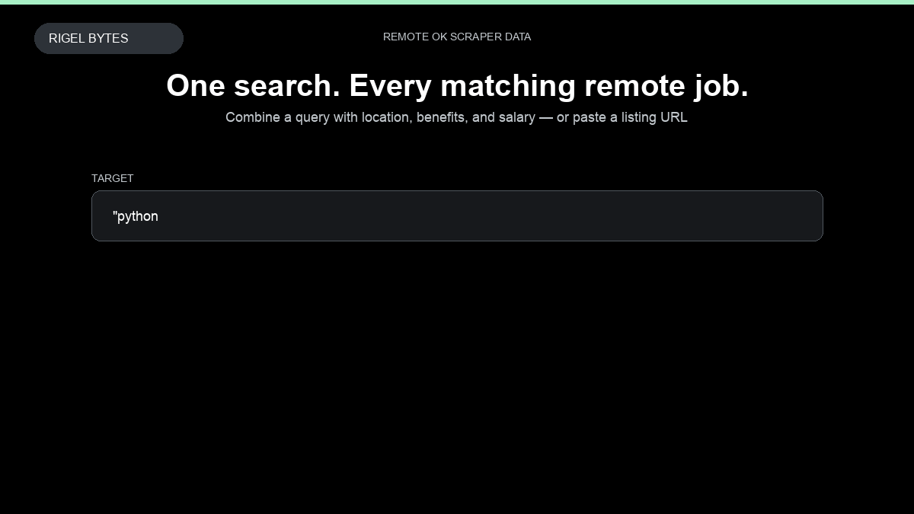

# Remote OK Scraper

**Remote OK Scraper** is an Apify Actor by Rigel Bytes for Remote OK data.

This folder hosts the public demo GIF used on the Actor README. The scraper itself runs on Apify Store — not in this repository.

**[Remote OK Scraper on Apify](https://apify.com/rigelbytes/remoteok-scraper)**

## What this Remote OK scraper does

Extract remote job listings from Remote OK with filters for role, location, benefits, and salary.

Use it as a Remote OK scraper to extract structured data and export CSV, JSON, Excel, or XML from Apify.

## Start here

1. Open [Remote OK Scraper](https://apify.com/rigelbytes/remoteok-scraper) on Apify Store.
2. Paste your Remote OK URLs, queries, or other documented inputs.
3. Click **Start** and export JSON, CSV, Excel, or XML.

If you found this GitHub page while looking for a Remote OK scraper, use the Apify link above to run it.
