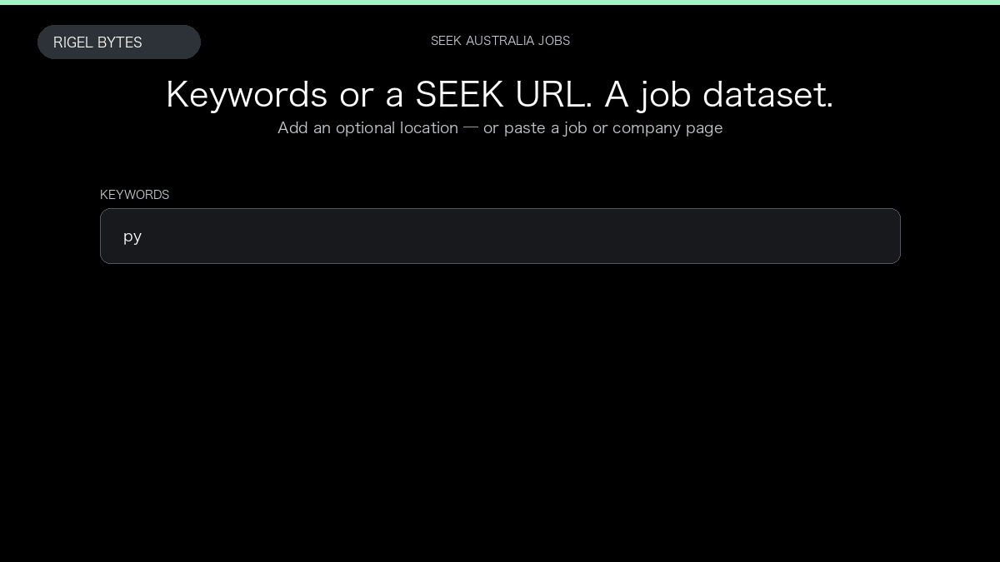

# SEEK Australia Jobs Scraper

**SEEK Australia Jobs Scraper** is an Apify Actor by Rigel Bytes for SEEK Australia data.

This folder hosts the public demo GIF used on the Actor README. The scraper itself runs on Apify Store — not in this repository.

**[SEEK Australia Jobs Scraper on Apify](https://apify.com/rigelbytes/seek-au-jobs-scraper)**

## What this SEEK Australia scraper does

Extract SEEK Australia job listings, salaries, company profiles, and reviews for hiring intelligence and market research.

Use it as a SEEK Australia scraper to extract structured data and export CSV, JSON, Excel, or XML from Apify.

## Start here

1. Open [SEEK Australia Jobs Scraper](https://apify.com/rigelbytes/seek-au-jobs-scraper) on Apify Store.
2. Paste your SEEK Australia URLs, queries, or other documented inputs.
3. Click **Start** and export JSON, CSV, Excel, or XML.

If you found this GitHub page while looking for a SEEK Australia scraper, use the Apify link above to run it.
