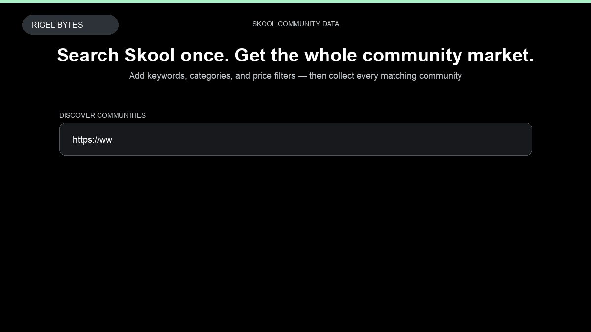

# Skool Community Scraper

**Skool Community Scraper** is an Apify Actor by Rigel Bytes for Skool data.

This folder hosts the public demo GIF used on the Actor README. The scraper itself runs on Apify Store — not in this repository.

**[Skool Community Scraper on Apify](https://apify.com/rigel-bytes/skool-scraper)**

## What this Skool scraper does

Scrape Skool communities by discovery search, category filters, or direct community URLs, plus optional about-page details, owner, reviews, top members, classroom, and calendar. Get community market intelligence — membership counts, pricing, ratings, and niches — in structured JSON, CSV, or Excel from Apify.

Use it as a Skool scraper to extract structured data and export CSV, JSON, Excel, or XML from Apify.

## Start here

1. Open [Skool Community Scraper](https://apify.com/rigel-bytes/skool-scraper) on Apify Store.
2. Paste your Skool URLs, queries, or other documented inputs.
3. Click **Start** and export JSON, CSV, Excel, or XML.

If you found this GitHub page while looking for a Skool scraper, use the Apify link above to run it.
