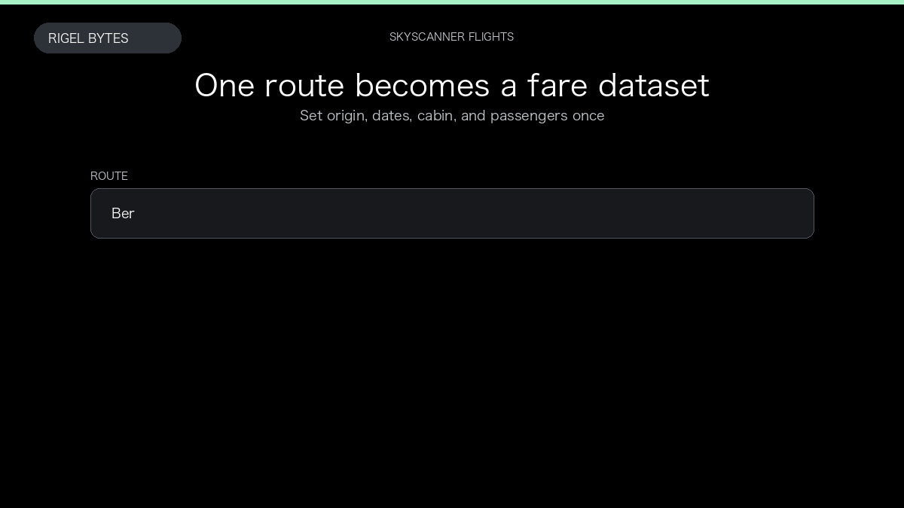

# Skyscanner Flights Scraper

**Skyscanner Flights Scraper** is an Apify Actor by Rigel Bytes for Skyscanner data.

This folder hosts the public demo GIF used on the Actor README. The scraper itself runs on Apify Store — not in this repository.

**[Skyscanner Flights Scraper on Apify](https://apify.com/rigelbytes/skyscanner-scraper)**

## What this Skyscanner scraper does

Compare one-way and return Skyscanner flights, including prices, airlines, stops, and optional booking-panel details.

Use it as a Skyscanner scraper to extract structured data and export CSV, JSON, Excel, or XML from Apify.

## Start here

1. Open [Skyscanner Flights Scraper](https://apify.com/rigelbytes/skyscanner-scraper) on Apify Store.
2. Paste your Skyscanner URLs, queries, or other documented inputs.
3. Click **Start** and export JSON, CSV, Excel, or XML.

If you found this GitHub page while looking for a Skyscanner scraper, use the Apify link above to run it.
