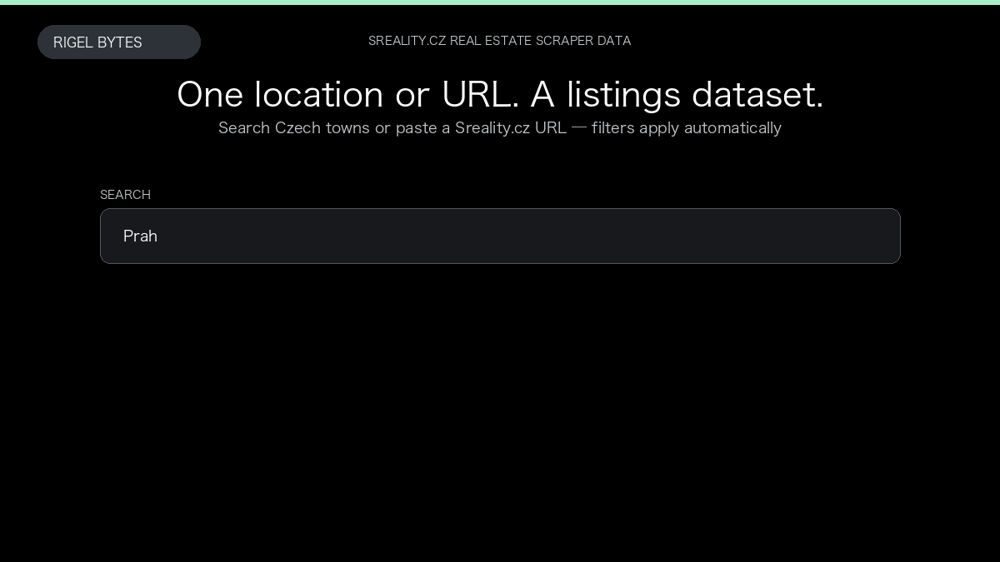

# Sreality.cz Real Estate Scraper

**Sreality.cz Real Estate Scraper** is an Apify Actor by Rigel Bytes for Sreality.cz data.

This folder hosts the public demo GIF used on the Actor README. The scraper itself runs on Apify Store — not in this repository.

**[Sreality.cz Real Estate Scraper on Apify](https://apify.com/rigelbytes/sreality-scraper)**

## What this Sreality.cz scraper does

Scrape apartments, houses, land, and commercial property from Sreality.cz by location or URL. Export listing cards with optional full details and agent contact information.

Use it as a Sreality.cz scraper to extract structured data and export CSV, JSON, Excel, or XML from Apify.

## Start here

1. Open [Sreality.cz Real Estate Scraper](https://apify.com/rigelbytes/sreality-scraper) on Apify Store.
2. Paste your Sreality.cz URLs, queries, or other documented inputs.
3. Click **Start** and export JSON, CSV, Excel, or XML.

If you found this GitHub page while looking for a Sreality.cz scraper, use the Apify link above to run it.
