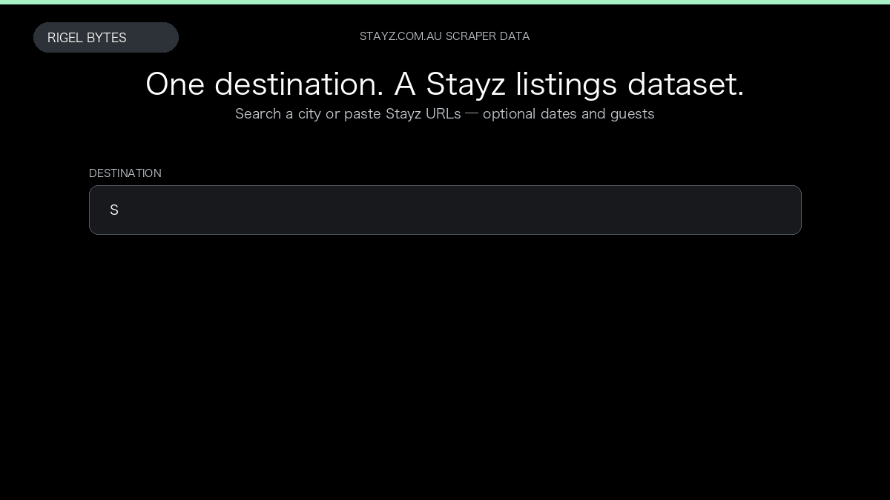

# Stayz.com.au Scraper

**Stayz.com.au Scraper** is an Apify Actor by Rigel Bytes for Stayz data.

This folder hosts the public demo GIF used on the Actor README. The scraper itself runs on Apify Store — not in this repository.

**[Stayz.com.au Scraper on Apify](https://apify.com/rigelbytes/stayz-com-au)**

## What this Stayz scraper does

Extract Stayz Australia holiday rental listings, prices, and optional host details for market research and price monitoring.

Use it as a Stayz scraper to extract structured data and export CSV, JSON, Excel, or XML from Apify.

## Start here

1. Open [Stayz.com.au Scraper](https://apify.com/rigelbytes/stayz-com-au) on Apify Store.
2. Paste your Stayz URLs, queries, or other documented inputs.
3. Click **Start** and export JSON, CSV, Excel, or XML.

If you found this GitHub page while looking for a Stayz scraper, use the Apify link above to run it.
