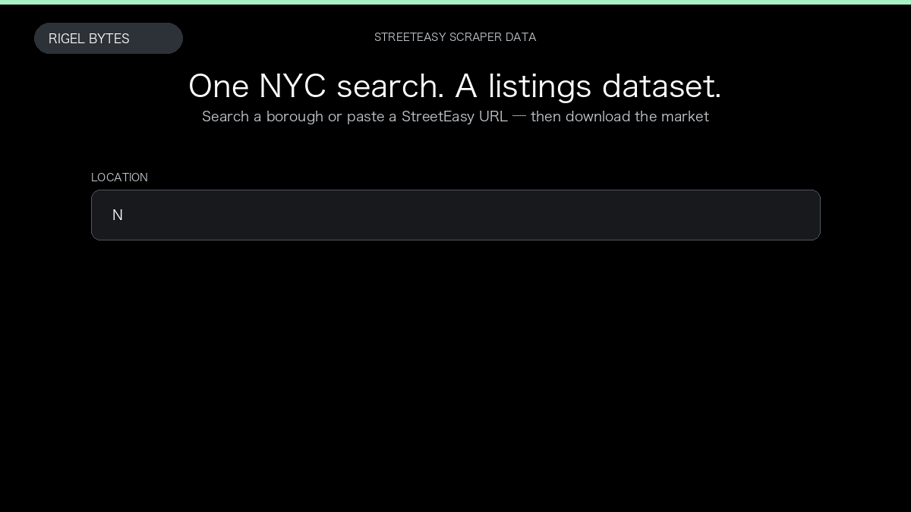

# StreetEasy Scraper

**StreetEasy Scraper** is an Apify Actor by Rigel Bytes for StreetEasy data.

This folder hosts the public demo GIF used on the Actor README. The scraper itself runs on Apify Store — not in this repository.

**[StreetEasy Scraper on Apify](https://apify.com/rigelbytes/streeteasy-scraper)**

## What this StreetEasy scraper does

Extract StreetEasy NYC for-rent and for-sale listings — prices, beds, baths, neighborhoods, and optional listing-page details — for market research, monitoring, and outreach.

Use it as a StreetEasy scraper to extract structured data and export CSV, JSON, Excel, or XML from Apify.

## Start here

1. Open [StreetEasy Scraper](https://apify.com/rigelbytes/streeteasy-scraper) on Apify Store.
2. Paste your StreetEasy URLs, queries, or other documented inputs.
3. Click **Start** and export JSON, CSV, Excel, or XML.

If you found this GitHub page while looking for a StreetEasy scraper, use the Apify link above to run it.
