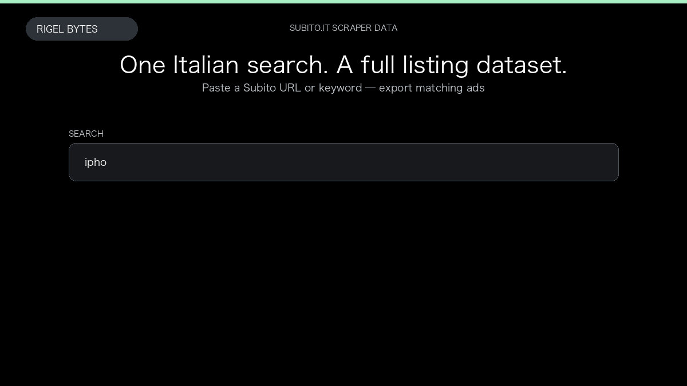

# Subito.it Scraper

**Subito.it Scraper** is an Apify Actor by Rigel Bytes for Subito.it data.

This folder hosts the public demo GIF used on the Actor README. The scraper itself runs on Apify Store — not in this repository.

**[Subito.it Scraper on Apify](https://apify.com/rigelbytes/subito-scraper)**

## What this Subito.it scraper does

Extract classified ads from Subito.it by keyword or URL into structured listing data for price monitoring and market research.

Use it as a Subito.it scraper to extract structured data and export CSV, JSON, Excel, or XML from Apify.

## Start here

1. Open [Subito.it Scraper](https://apify.com/rigelbytes/subito-scraper) on Apify Store.
2. Paste your Subito.it URLs, queries, or other documented inputs.
3. Click **Start** and export JSON, CSV, Excel, or XML.

If you found this GitHub page while looking for a Subito.it scraper, use the Apify link above to run it.
