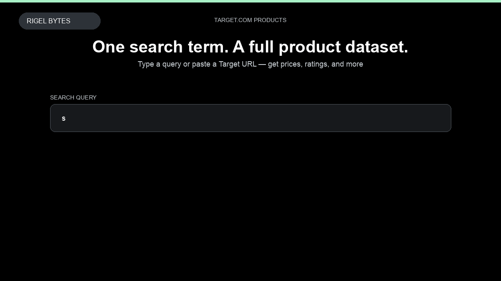

# Target.com Product Scraper

**Target.com Product Scraper** is an Apify Actor by Rigel Bytes for Target.com data.

This folder hosts the public demo GIF used on the Actor README. The scraper itself runs on Apify Store — not in this repository.

**[Target.com Product Scraper on Apify](https://apify.com/rigelbytes/target-scraper)**

## What this Target.com scraper does

Scrape Target.com product listings with prices, ratings, and reviews for price monitoring and market research.

Use it as a Target.com scraper to extract structured data and export CSV, JSON, Excel, or XML from Apify.

## Start here

1. Open [Target.com Product Scraper](https://apify.com/rigelbytes/target-scraper) on Apify Store.
2. Paste your Target.com URLs, queries, or other documented inputs.
3. Click **Start** and export JSON, CSV, Excel, or XML.

If you found this GitHub page while looking for a Target.com scraper, use the Apify link above to run it.
