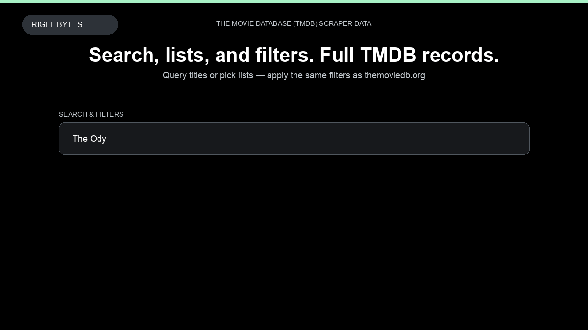

# The Movie Database (TMDB) Scraper

**The Movie Database (TMDB) Scraper** is an Apify Actor by Rigel Bytes for The Movie Database (TMDB) data.

This folder hosts the public demo GIF used on the Actor README. The scraper itself runs on Apify Store — not in this repository.

**[The Movie Database (TMDB) Scraper on Apify](https://apify.com/rigelbytes/themoviedb-scraper)**

## What this The Movie Database (TMDB) scraper does

Scrape movies, TV shows, people, and awards from themoviedb.org with list filters, cast, reviews, and images — for catalog research, streaming intelligence, and content databases.

Use it as a The Movie Database (TMDB) scraper to extract structured data and export CSV, JSON, Excel, or XML from Apify.

## Start here

1. Open [The Movie Database (TMDB) Scraper](https://apify.com/rigelbytes/themoviedb-scraper) on Apify Store.
2. Paste your The Movie Database (TMDB) URLs, queries, or other documented inputs.
3. Click **Start** and export JSON, CSV, Excel, or XML.

If you found this GitHub page while looking for a The Movie Database (TMDB) scraper, use the Apify link above to run it.
