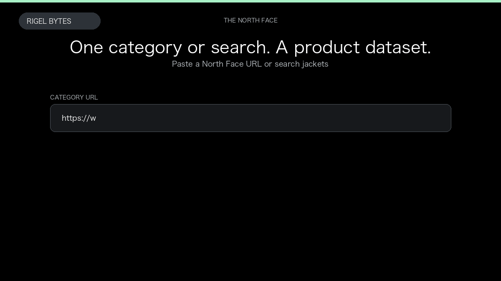

# The North Face Scraper

**The North Face Scraper** is an Apify Actor by Rigel Bytes for The North Face data.

This folder hosts the public demo GIF used on the Actor README. The scraper itself runs on Apify Store — not in this repository.

**[The North Face Scraper on Apify](https://apify.com/rigelbytes/thenorthface-scraper)**

## What this The North Face scraper does

Extract The North Face product prices, colors, ratings, and size stock from category pages, search, or product links, then export JSON, CSV, or Excel.

Use it as a The North Face scraper to extract structured data and export CSV, JSON, Excel, or XML from Apify.

## Start here

1. Open [The North Face Scraper](https://apify.com/rigelbytes/thenorthface-scraper) on Apify Store.
2. Paste your The North Face URLs, queries, or other documented inputs.
3. Click **Start** and export JSON, CSV, Excel, or XML.

If you found this GitHub page while looking for a The North Face scraper, use the Apify link above to run it.
