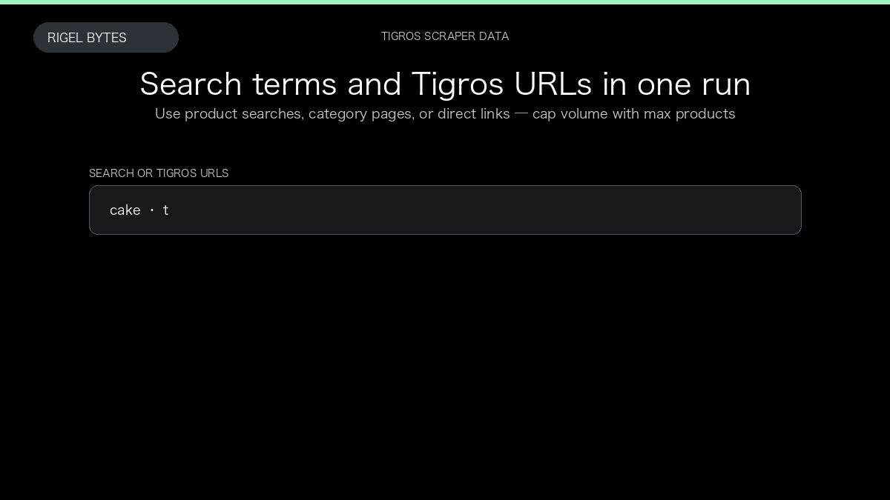

# Tigros Scraper

**Tigros Scraper** is an Apify Actor by Rigel Bytes for Tigros data.

This folder hosts the public demo GIF used on the Actor README. The scraper itself runs on Apify Store — not in this repository.

**[Tigros Scraper on Apify](https://apify.com/rigelbytes/tigros-scraper)**

## What this Tigros scraper does

Scrape Tigros Italy grocery products from search or category URLs with optional ingredients and image galleries.

Use it as a Tigros scraper to extract structured data and export CSV, JSON, Excel, or XML from Apify.

## Start here

1. Open [Tigros Scraper](https://apify.com/rigelbytes/tigros-scraper) on Apify Store.
2. Paste your Tigros URLs, queries, or other documented inputs.
3. Click **Start** and export JSON, CSV, Excel, or XML.

If you found this GitHub page while looking for a Tigros scraper, use the Apify link above to run it.
