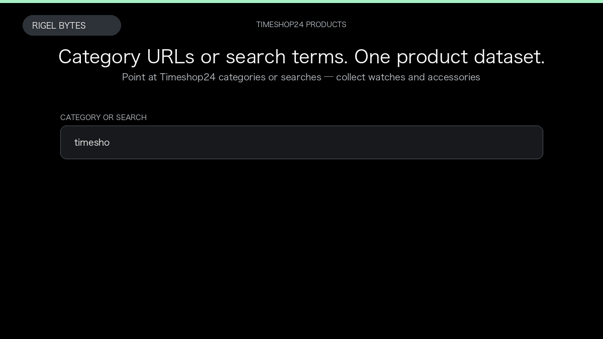

# Timeshop24 Scraper

**Timeshop24 Scraper** is an Apify Actor by Rigel Bytes for Timeshop24 data.

This folder hosts the public demo GIF used on the Actor README. The scraper itself runs on Apify Store — not in this repository.

**[Timeshop24 Scraper on Apify](https://apify.com/rigelbytes/timeshop24-scraper)**

## What this Timeshop24 scraper does

Extract watches and accessories from Timeshop24 category pages and search. Get brand, price, stock, and optional SKU, specs, and images for catalog research and price tracking.

Use it as a Timeshop24 scraper to extract structured data and export CSV, JSON, Excel, or XML from Apify.

## Start here

1. Open [Timeshop24 Scraper](https://apify.com/rigelbytes/timeshop24-scraper) on Apify Store.
2. Paste your Timeshop24 URLs, queries, or other documented inputs.
3. Click **Start** and export JSON, CSV, Excel, or XML.

If you found this GitHub page while looking for a Timeshop24 scraper, use the Apify link above to run it.
