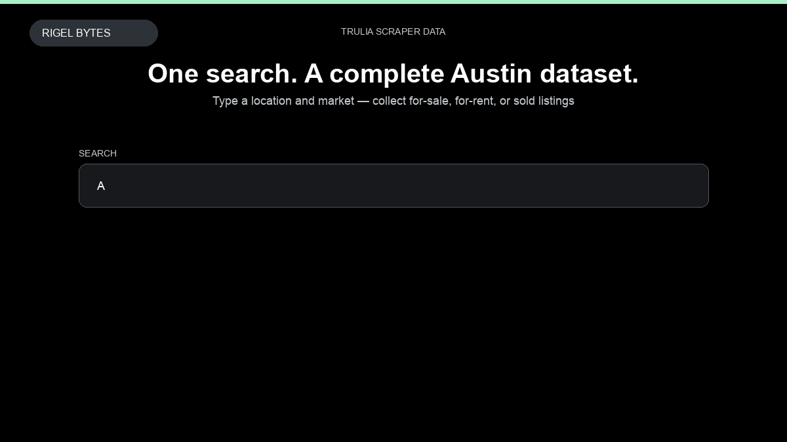

# Trulia Scraper

**Trulia Scraper** is an Apify Actor by Rigel Bytes for Trulia data.

This folder hosts the public demo GIF used on the Actor README. The scraper itself runs on Apify Store — not in this repository.

**[Trulia Scraper on Apify](https://apify.com/rigelbytes/trulia-scraper)**

## What this Trulia scraper does

Extract for-sale, for-rent, and sold real estate listings from Trulia with optional property-page details for market research, lead generation, and price monitoring.

Use it as a Trulia scraper to extract structured data and export CSV, JSON, Excel, or XML from Apify.

## Start here

1. Open [Trulia Scraper](https://apify.com/rigelbytes/trulia-scraper) on Apify Store.
2. Paste your Trulia URLs, queries, or other documented inputs.
3. Click **Start** and export JSON, CSV, Excel, or XML.

If you found this GitHub page while looking for a Trulia scraper, use the Apify link above to run it.
