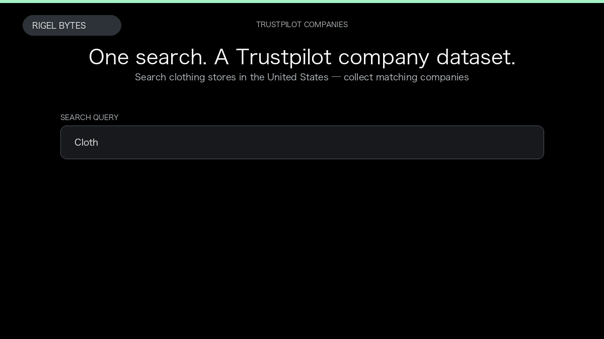

# Trustpilot Company Scraper

**Trustpilot Company Scraper** is an Apify Actor by Rigel Bytes for Trustpilot data.

This folder hosts the public demo GIF used on the Actor README. The scraper itself runs on Apify Store — not in this repository.

**[Trustpilot Company Scraper on Apify](https://apify.com/rigelbytes/trustpilot-scraper)**

## What this Trustpilot scraper does

Extract Trustpilot company listings, profile details, and reviews for competitor monitoring, lead lists, and review intelligence.

Use it as a Trustpilot scraper to extract structured data and export CSV, JSON, Excel, or XML from Apify.

## Start here

1. Open [Trustpilot Company Scraper](https://apify.com/rigelbytes/trustpilot-scraper) on Apify Store.
2. Paste your Trustpilot URLs, queries, or other documented inputs.
3. Click **Start** and export JSON, CSV, Excel, or XML.

If you found this GitHub page while looking for a Trustpilot scraper, use the Apify link above to run it.
