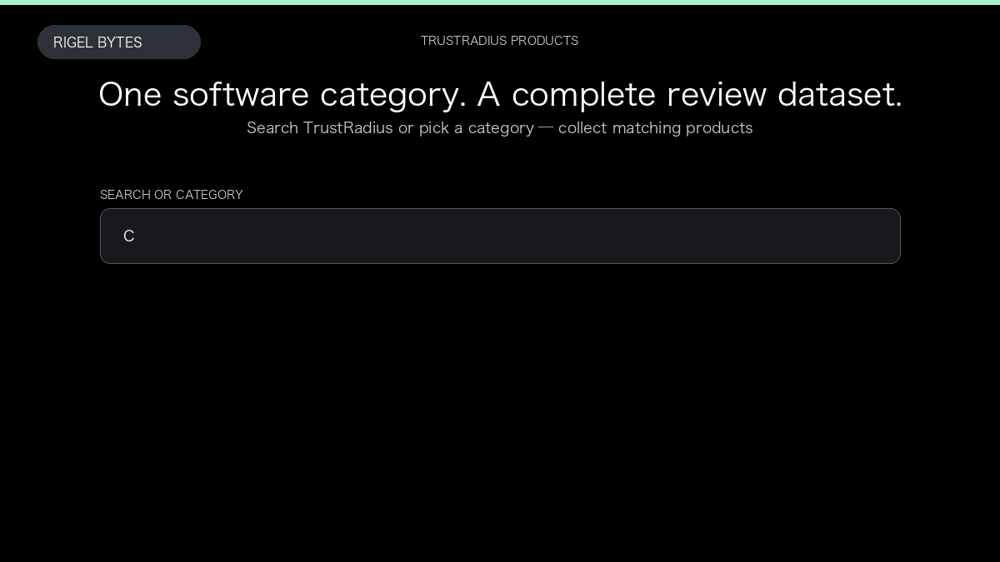

# TrustRadius Scraper

**TrustRadius Scraper** is an Apify Actor by Rigel Bytes for TrustRadius data.

This folder hosts the public demo GIF used on the Actor README. The scraper itself runs on Apify Store — not in this repository.

**[TrustRadius Scraper on Apify](https://apify.com/rigelbytes/trustradius-scraper)**

## What this TrustRadius scraper does

Extract TrustRadius companies, product details, scores, and reviews from search, categories, or product URLs for competitive research and category monitoring.

Use it as a TrustRadius scraper to extract structured data and export CSV, JSON, Excel, or XML from Apify.

## Start here

1. Open [TrustRadius Scraper](https://apify.com/rigelbytes/trustradius-scraper) on Apify Store.
2. Paste your TrustRadius URLs, queries, or other documented inputs.
3. Click **Start** and export JSON, CSV, Excel, or XML.

If you found this GitHub page while looking for a TrustRadius scraper, use the Apify link above to run it.
