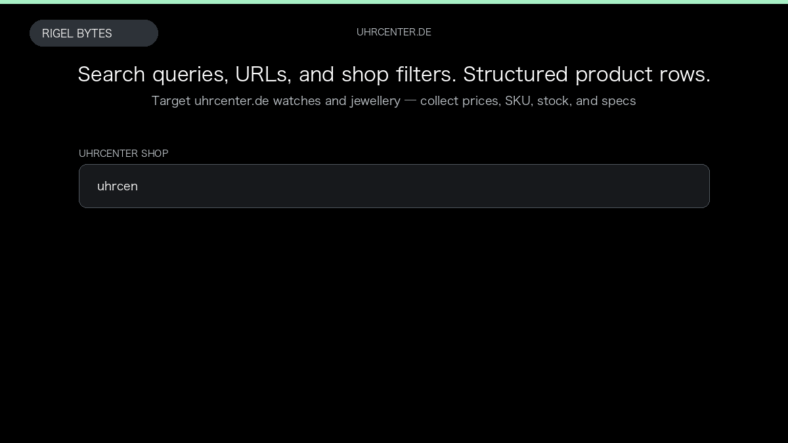

# Uhrcenter Scraper

**Uhrcenter Scraper** is an Apify Actor by Rigel Bytes for Uhrcenter data.

This folder hosts the public demo GIF used on the Actor README. The scraper itself runs on Apify Store — not in this repository.

**[Uhrcenter Scraper on Apify](https://apify.com/rigelbytes/uhrcenter-scraper)**

## What this Uhrcenter scraper does

Scrape watches and jewellery from uhrcenter.de by keyword, category URL, and shop filters into structured product records for price monitoring and catalog research.

Use it as a Uhrcenter scraper to extract structured data and export CSV, JSON, Excel, or XML from Apify.

## Start here

1. Open [Uhrcenter Scraper](https://apify.com/rigelbytes/uhrcenter-scraper) on Apify Store.
2. Paste your Uhrcenter URLs, queries, or other documented inputs.
3. Click **Start** and export JSON, CSV, Excel, or XML.

If you found this GitHub page while looking for a Uhrcenter scraper, use the Apify link above to run it.
