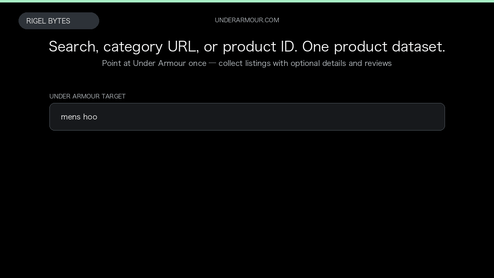

# Under Armour Scraper

**Under Armour Scraper** is an Apify Actor by Rigel Bytes for Under Armour data.

This folder hosts the public demo GIF used on the Actor README. The scraper itself runs on Apify Store — not in this repository.

**[Under Armour Scraper on Apify](https://apify.com/rigelbytes/underarmour-scraper)**

## What this Under Armour scraper does

Scrape Under Armour product listings from search queries, category URLs, or style numbers, with optional product details and customer reviews for price tracking and catalog building.

Use it as a Under Armour scraper to extract structured data and export CSV, JSON, Excel, or XML from Apify.

## Start here

1. Open [Under Armour Scraper](https://apify.com/rigelbytes/underarmour-scraper) on Apify Store.
2. Paste your Under Armour URLs, queries, or other documented inputs.
3. Click **Start** and export JSON, CSV, Excel, or XML.

If you found this GitHub page while looking for a Under Armour scraper, use the Apify link above to run it.
