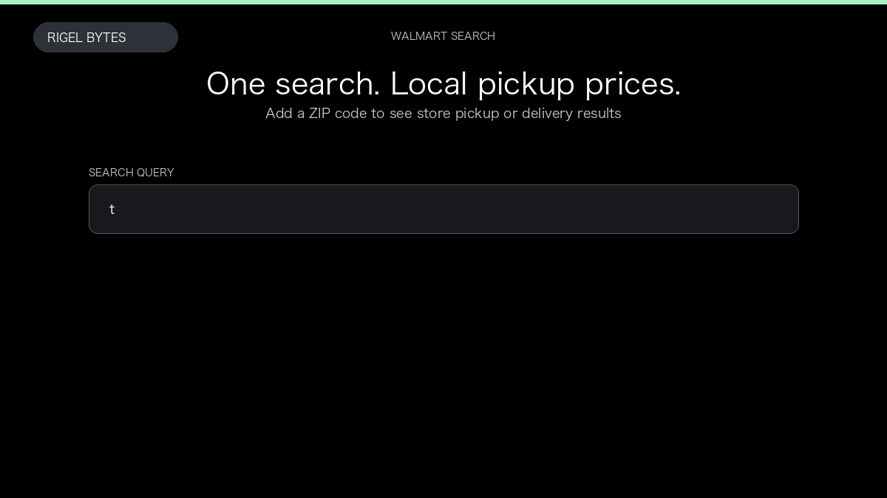

# Walmart Scraper

**Walmart Scraper** is an Apify Actor by Rigel Bytes for Walmart data.

This folder hosts the public demo GIF used on the Actor README. The scraper itself runs on Apify Store — not in this repository.

**[Walmart Scraper on Apify](https://apify.com/rigelbytes/walmart-scraper)**

## What this Walmart scraper does

Scrape Walmart search, category, and product pages into structured JSON with optional ZIP-based pickup context, product details, and nested reviews.

Use it as a Walmart scraper to extract structured data and export CSV, JSON, Excel, or XML from Apify.

## Start here

1. Open [Walmart Scraper](https://apify.com/rigelbytes/walmart-scraper) on Apify Store.
2. Paste your Walmart URLs, queries, or other documented inputs.
3. Click **Start** and export JSON, CSV, Excel, or XML.

If you found this GitHub page while looking for a Walmart scraper, use the Apify link above to run it.
