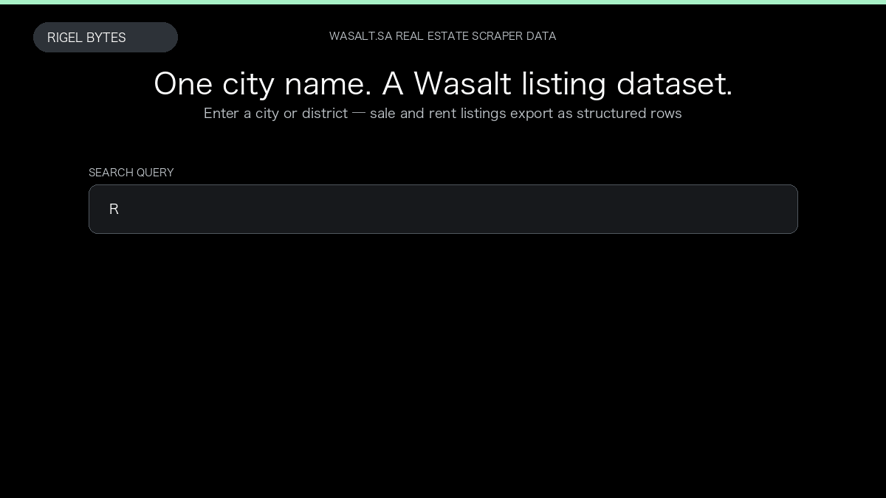

# Wasalt.sa Real Estate Scraper

**Wasalt.sa Real Estate Scraper** is an Apify Actor by Rigel Bytes for Wasalt.sa data.

This folder hosts the public demo GIF used on the Actor README. The scraper itself runs on Apify Store — not in this repository.

**[Wasalt.sa Real Estate Scraper on Apify](https://apify.com/rigelbytes/wasalt-sa-scraper)**

## What this Wasalt.sa scraper does

Scrape Wasalt.sa property listings from city searches or URLs. Export prices, beds, locations, and image URLs for Saudi market research, CRM, and alerts.

Use it as a Wasalt.sa scraper to extract structured data and export CSV, JSON, Excel, or XML from Apify.

## Start here

1. Open [Wasalt.sa Real Estate Scraper](https://apify.com/rigelbytes/wasalt-sa-scraper) on Apify Store.
2. Paste your Wasalt.sa URLs, queries, or other documented inputs.
3. Click **Start** and export JSON, CSV, Excel, or XML.

If you found this GitHub page while looking for a Wasalt.sa scraper, use the Apify link above to run it.
