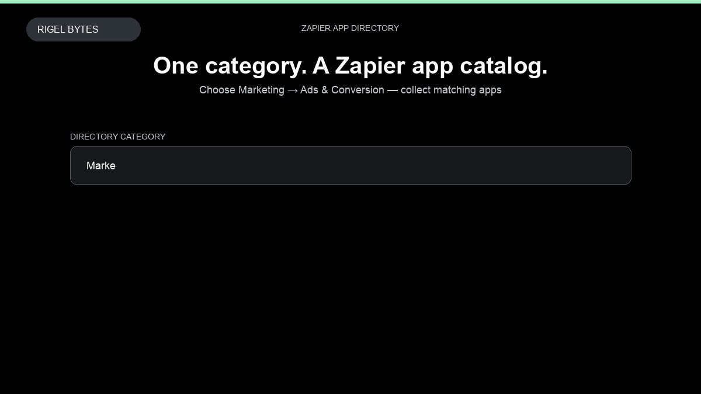

# Zapier Apps Scraper

**Zapier Apps Scraper** is an Apify Actor by Rigel Bytes for Zapier data.

This folder hosts the public demo GIF used on the Actor README. The scraper itself runs on Apify Store — not in this repository.

**[Zapier Apps Scraper on Apify](https://apify.com/rigelbytes/zapier-apps-scraper)**

## What this Zapier scraper does

Extract Zapier app directory listings by category or URL — names, websites, premium/beta flags, and optional triggers, actions, and integrations.

Use it as a Zapier scraper to extract structured data and export CSV, JSON, Excel, or XML from Apify.

## Start here

1. Open [Zapier Apps Scraper](https://apify.com/rigelbytes/zapier-apps-scraper) on Apify Store.
2. Paste your Zapier URLs, queries, or other documented inputs.
3. Click **Start** and export JSON, CSV, Excel, or XML.

If you found this GitHub page while looking for a Zapier scraper, use the Apify link above to run it.
