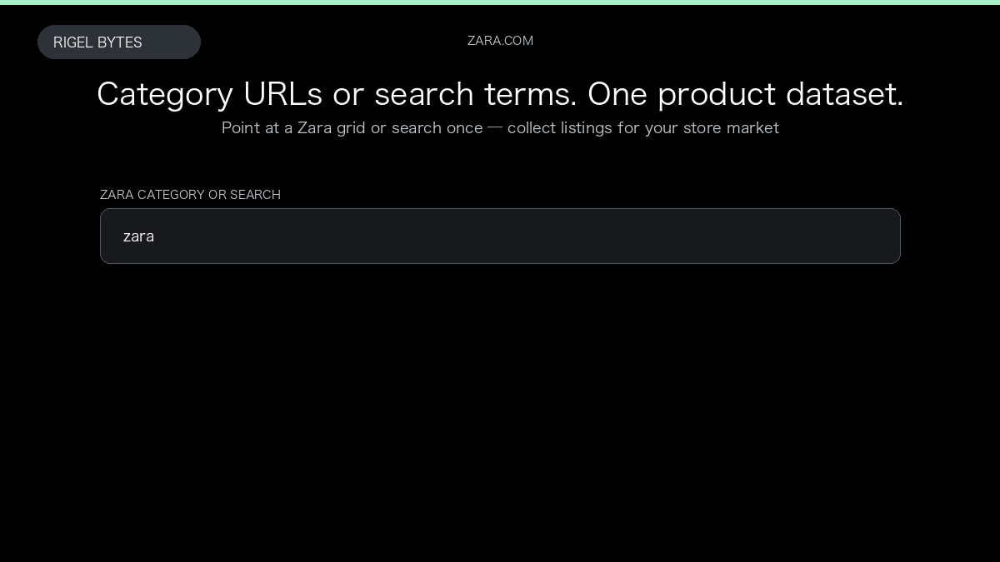

# Zara Scraper

**Zara Scraper** is an Apify Actor by Rigel Bytes for Zara data.

This folder hosts the public demo GIF used on the Actor README. The scraper itself runs on Apify Store — not in this repository.

**[Zara Scraper on Apify](https://apify.com/rigelbytes/zara-scraper)**

## What this Zara scraper does

Scrape Zara category pages and search results into structured product records with prices, colours, availability, and optional size and composition details.

Use it as a Zara scraper to extract structured data and export CSV, JSON, Excel, or XML from Apify.

## Start here

1. Open [Zara Scraper](https://apify.com/rigelbytes/zara-scraper) on Apify Store.
2. Paste your Zara URLs, queries, or other documented inputs.
3. Click **Start** and export JSON, CSV, Excel, or XML.

If you found this GitHub page while looking for a Zara scraper, use the Apify link above to run it.
